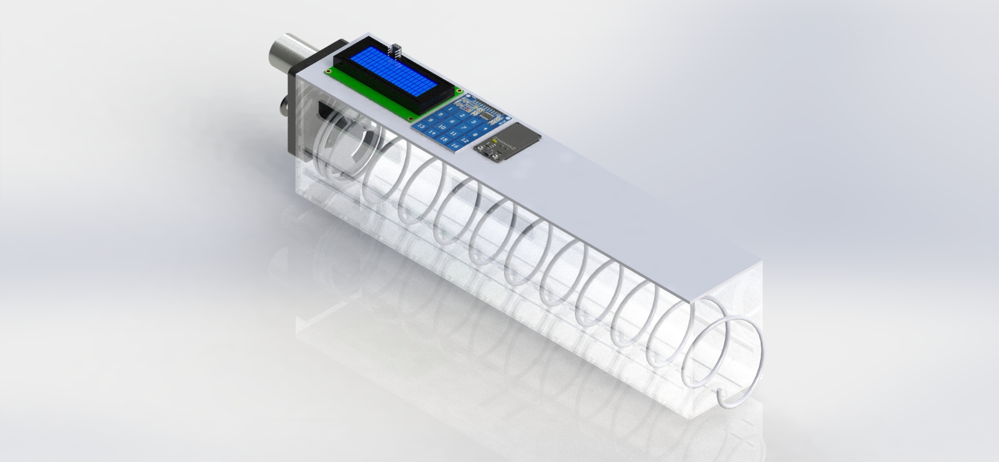

<!-- Headings --> <!-- Strong --> <!-- Italics --> <!-- Blockquote --> <!-- Links --> <!-- UL --> <!-- OL --> <!-- Images --> <!-- Code Blocks --> <!-- Tables --> 
<!-- Task Lists -->

# RandomBox (Vending Machine)
> ### Integration: [API](https://lojaintegrada.docs.apiary.io/#reference) + [Loja Integrada](https://lojaintegrada.com.br/) + [FreeRTO's](https://www.freertos.org/) + [ESP32](https://www.espressif.com/en/products/socs/esp32/overview)

- The main objective of the project has the intention of providing resources for **Hardware developers** , as well as providing access to the most diverse development platform options such as the module family of [Espressif](https://www.espressif.com/en), [Arduino](https://www.arduino.cc/en/main/products), [STM32](https://www.st.com/content/st_com/en/support/learning/stm32-education/stm32-step-by-step.html), and various electronic components that every developer would like to have access to.

> ### How is RandomBox going to work?
- Flow process:
***I'm going to translate the flow process as soon as possible***

> ### Softawares
1. VsCode
1. AWS IOT, Lambda
1. SolidWorks

> ### Hardwares
1. ESP32
1. Keyboard TTP229

> ### Security
1. Key Registers(Polices) from AWS
1. Tokens provides by API (Loja Integrada)
1. MQTT Protocols

> ### Protoypes Videos
**Click on the text below to watch on Youtube Channel**

* [Esp_32 + FreeRTO's + API_Loja_Integrada](https://youtu.be/USlRwm8FtBU)
* [Esp_32 + FreeRTO's + API_Loja_Integrada New Functions](https://youtu.be/Byxi9N65fug) 
* [Central Suport Assenbly + Motor Assenbly](https://youtu.be/GkYKwFoSeXg) **Rendered**
* [Central Suport Assenbly + Motor Assenbly](https://youtu.be/XT-ZBJUHyEo) **No Rendered**

> ### Protoypes Images

> ### Error Founds

*Due to I2C errors with the use of the interrupts used by the TTP229 keyboard, this problem has been commented on in many forums, in Git's, by the developers.
  *https://github.com/espressif/arduino-esp32/issues/839
  *https://github.com/espressif/arduino-esp32/issues/1071
  *https://github.com/espressif/arduino-esp32/issues/834
  Among others...

* I had problems creating tasks, to use the LCD Display that was also used as I2C, for this reason and because I was familiar with FreeRTO's tools, I had to create devices to use only 2 tasks, 1 exclusively for the Touch and another general . I tried several times to create an exclusive task for the LCD Display, but when creating, the behavior was unstable, I2C timeout errors always occurred on his bus. Problem that the forums are trying to get right.
  * https://github.com/espressif/esp-idf/issues/1503
  * https://github.com/espressif/esp-idf/issues/680
  * https://github.com/espressif/arduino-esp32/issues/811

**If anyone wants to contribute to the improvements, thank you.**

The rest of the implementations, is the basic one with the manipulation of Jason and the Certificates of his Integrated Store.

To obtain your Application Key, you must open a request for support from the store.
The Token is generated -> Panel -> in the settings tab.

> ### Contact

> **Atention** If you go email me, please put as subject the name of the project, in this case: **(RandomBox) Requests**

|  Name |  Email | Mobile  |
|-------|--------|---------|
|  Yuri Lima | y.m.lima19@gmail.com  | +353 83 419.1605  |
